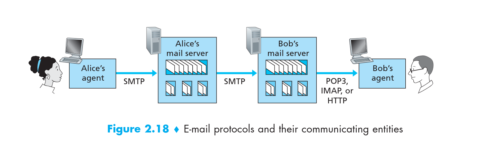

**The questions is provided below,we can find the answer in the Computer Network A Top-down Approach**
# HTTP
- HTTP is said to be a stateless protocol
##  no-persistent-connections and persistent-connections
no-persistent-connections:Client obtains the 10 JPEGs over 10 serial TCP connections or whether JEPGs are obtained over parallel TCP connections? 

Advantage of persistent-connections(or disadvantage of no-persistent-connections):NO-persistent-connection has some shortcoming.First, a brand-new connection must be established and maintained for each requires objects. For earn TCP connections, TCP buffer must be allocated and TCP variable keeps between client and servers, This is a significant burden on the web servers. But persistent-connections don't need to establish so many connections, just establish once connections can work. 
## HTTP Require and Response
**HTTP-Require**

**HTTP-Response**

## Cookie
Cookie allow web site to keep track of users. 
Cookie technology has four components:  
- a cookie header line in the HTTP response message.
- a cookie header line in the HTTP require message.
- a cookie file kept on user's end system and managed by user's browser
- a cookie back-end database at the web site.

## Web cache
Web cache also called proxy servers,Web cache can increasing response speed and reduce the cost of throughput.

## The condition GET
At explore above ,We already have cache ,We now face a problem is that if the informations  of requirements have been modified but the cache still stored the old information ,How to solve this problem? 
The answer is **The condition GET** ,. We can see details at the Computer network a Top-Down Approach 
# File Transfer Protocol (FTP)
## control connection and data connection 
**Control connection** is used for sending control informations between two host, such as identification, password, commands 
**Data connection** is used for actually send a file . 

FTP use port 21 as Control connection and use port 20 as Data connection 

As you see,FTP is established two TCP connections 

In the typically FTP sessions, Users initial access remote hosts, namely establish TCP control connection used port 21, then provide identifications and passwords through port 21. After providing this authorization information. Users can transfer files from localhost to remote host vice versa.

If user wanna to transfer another files during the same sessions,FTP will opens the another **data connections**(The data connections is no-persistent) 
Throughout a sessions,the FTP servers must maintain state about the user. In particularly, The servers must be associate the **control connections** with a specific user and must keep track of user's current directory as user's wanders about the remote directory tree. 

## FTP Commands and Replies
The FTP Commands and Replies sent across the control connection in 7-bits ASCLL format. 
We can see details at computer-network-a-top-down-approach.

# SMTP(Simple Mail Transfer Protocol)
SMTP is a principal application layer protocol for electronic mail. As most application layer protocol, SMTP base on TCP provides reliable data transfer service and SMTP also has two side , client side which executes on the sender's mail server, servers side which executes on recipient's mail servers. When the mail server send mail to other mail servers , it act as a SMTP client, when the mail server receive mail from other mail server, it act as SMTP server.

1. Alice provides Bob's email-address and composes a message then instruct Alice's agent  send the message to Bob. 
2. Alice's send the message to Alice's mail servers,where it is placeing in message queue. 
3. Alice's mail server established TCP connections to port 25 at Bob's mail server.  
4. After initail SMTP handshaking, the SMTP client (Alice's mail server) send the message to Bob's server through TCP connection. 
5. The recipient side receives the message and places the message in Bob mailbox. 
6. Bob invoke his user agent to read the message at his convenience. 

*In particular , if Bob's mail server is down . The message can't send to Bob's mail server, the message will remain in Alice's mail server and wait for a new attempt -- the message do not get place in any other intermediate mail server, Reattempt done for every 30 minutes , if
resend  not success after several day , Alice's mail server remove the message and notice Alice with e-mail message*  **More details of SMTP handshake or SMTP commands please see the Computer Network A Top-Down Approach**  
 ## Comparison with HTTP
1. HTTP and SMTP both use persistent connections
2. HTTP is mainly a pull protocol -- Some one load information with browser on web servers or use HTTP to pull some information from the server at their convenience. SMTP is mainly a push protocol -- The sending mail server push file to other receiving mail server .   
3. SMTP requires each message include body of each message that must be encode be 7-bit-ASCLL , so that The SMTP is a bit of pain to send the large attachment ,video, image, audio. But HTTP data does not impose this restriction.  
4. HTTP encapsulate each object in it own HTTP response message , SMTP place all message's object into one message. 
## Mail Access Protocol
Bob can't obtain the message through SMTP from the Bob's mail server. Because SMTP is push protocol,obtain message is pull operation. To solve this problem by introducing a special mail access protocol that transfer messages from Bob's mail server to Bob's host .There are currently a number of mail access protocol including **Post Office Protocol - version 3 (POP3),Internet Mail Access Protocol (IMAP) and HTTP**

### POP3 (Post Office Protocol -Version 3)
POP3 Bob's agent use port 110 establish TCP connection with Bob's mail servers , With the TCP connections established , POP3 through three phase: **authorization**, **transaction**, **Update**. 
1. **authorization**: Bob's agent send the username and password to authenticate the user 2. **transaction**: During this phase , user agent can mark retrieves the message also can mark message for deletion (or remove the mask) ,and obtain mail statistic .  3. **Update**: Update occurs after user agent issued the *quit* command ending this POP3 session ,at this time, mail server will delete messages that were marked for deletion. 

*more details about POP3 commands or process can see in the textbook* 

**During the POP3 sessions, the user agent and mail server maintain some state information. For example, maintain mark information for deletion during this POP3 session. However, POP3 doesn't carry state information across POP3 sessions. (As I think, that's mean POP3 maintain state information only occurs at POP3 sessions phase ,the state information will be deleted,if user agent ending the session)**
### IMAP (Internet Mail Access Protocol)
The IMAP is significantly complex than POP3,and more feature than POP3 
**The most significantly difference is IMAP can carry the state informations across IMAP sessions, but POP3 can't** 

### Web-base Email (use HTTP)
Web-base Email also famous today, for example gmail . Web browser and user communicates with its mailbox via HTTP.

# DNS (domain name system)
**The DNS protocols run over UDP and uses port 53.**  

The DNS is commonly employed by other application-layer protocol --including HTTP,SMTP, and FTP --to translate the user-supplied hostnames to IP address. 

We see example above the DNS adds an additional delay, but ,fortunately the DNS cache will help reduce this delay.  

DNS provide features: **Host aliasing** , **Mail server aliasing** , **Load distribution**
- host aliasing and mail server aliasing make hostnames more mnemonic. 
- load distribution : For replicated web server , a numbers set of IP address associated with one canonical hostname . It can make server easier to handle the large access . 
## overview of how DNS work
**Let's take closer to look at these three classes of DNS servers**  
- Root DNS servers.
- Top-level domain(TLD) server.
- Authoritative DNS server.

Take a look a simple example : **www.amazon.com.** (Don't forget we have a . at the end)  
- The **.** is Root DNS servers.
- The **com.** is Top-lever domain (TLD) server
- The **amazon.com.** is Authoritative DNS server.
- The **www** is hostname 

We also have a another critically important DNS servers is **Local DNS server** that does not strictly belong to the hierarchy of DNS server. 
When the host make a DNS query, the query is send to Local DNS server which act as proxy forwarding the query into the DNS hierarchy server. 
## Two way for send DNS queries
- **iterative queries** 

- **recursive queries**

## DNS caching
We reduce the delay of DNS server by DNS cache technology. 

**The DNS server receives a DNS reply (for example the mapping of IP address and hostname) it can cache the mapping into the local memory(also can cache the mapping of TLD servers). For example , the local DNS server can cache the mapping of each host queries,When the user's host send a query to local DNS server frequently at the short period of time . The local DNS server can send the reply to user's host instantly**. 

*The DNS servers discard the cache information after a period time (Often set to one or two day)* 
## DNS Records and Messages
### DNS Records
The DNS distributed database store **resource records (RRs)** 
The RRs provide Hostname-to-IP address mappings.Each DNS reply carries one or more RRs . 
#### DNS Records Format
The DNS Record have four fields that provide following below. 

|Name|Value|Type|TTL|
|:-----|:-----|:-----|:-----|

The TTL is live time of Records in the RRs . The meaning of Name and Value is depend on Type.  

In following example we will ignore the TTL filed. 

|Type|Name|Value|Description|
|:-----:|:-----:|:-----:|:-----:|
|A|Hostname|IP address|Address record|
|NS|Domain|Hostname of authoritative|Name server record|
|CNAME|Alisa hostname|Canonical name|Canonical name record|
|MX|Alisa hostname of mail server|Canonical name of mail server|Mail exchange record|

**If a DNS server is authoritative for particular hostname ,then the DNS server will contain type A record for the hostname.** 

**If a DNS server is not authoritative for a hostname ,then it will contain a type NS record for domain that include hostname, it also contain a type A record that provide IP address of DNS server in the value field of the NS record.** 
- For example in the TLD server 

|Type|Name|Value|
|:-----:|:-----:|:-----:|
|NS|umass.edu|dns.umass.edu|
|A|dns.umass.edu|128.119.40.111|

## DNS Messages
The DNS query and DNS reply have same Messages format as shown in Figure below . 
- **DNS-Messages-Format** 

- **We can use dig command to see DNS reply messages**

ID:30379 is 16-bit number that identifies the query corresponding **identification** of figure above .This identifies is copied into the reply messages allowing the client match receive messages with sent queries.  
**Let's see more detail about header flags format** 

|Flag field|Description|Length(bits)|
|:----:|:----:|:----:|
|OR|indicate message is reply(1) or query(0) |1|
|OPCODE|The type can be QUERY(standard query ,0),IQUERY(inverse query,1) or STATUS(server status request,2)|4|
|AA|Authoritative Answer, in the response,indicates if the DNS server is authoritative for queried hostname|1|
|TC|Truncation, indicates that this messages was truncated due excessive length|1|
|RD|Recursion desired indicate if client means a recursion query.|1|
|RA|Recursion Available indicate if reply messages supports recursion|1|
|Z|zero ,reserved for future use|3|
|RCODE|Response code, can be NOERROR(0),FORMERR(format error,1),SERVFAIL(2),NXDOMAIN(nonexistent domain 3),etc|4|

# Peer-to-Peer Applications
## BitTorrent
BitTorrent is popular P2P protocol for file distribution. 

In BItTorrent lingo, the collection of all peer in the distribution is called torrent. 

Each torrent has a infrastructure called tracker.When a peer join in a torrent, it must register itself with tracker and periodically informs the tracker that it is still in the torrent. In this manner the tracker can keep the track of the peers that participating in the torrent.   

**Let we see a example to know more detail about how does p2p work.** 
When a new peer Alice  want to join in torrent,what does it need to do.
1. Alice must register herself with tracker.
2. The tracker will randomly select a subset of peers from a set of participating peers and send the all IP address of subset peers to Alice
3. Alice attempts concurrent establish TCP connection with subset peers. The succeed establish TCP connection peer is called **"neighboring peers"**. The neighboring peer probably leave at any time .
4. Periodically Alice will ask (over the TCP connection)neighboring peer for list of chucks they have. If Alice have L neighboring peers ,Alice will obtain L list of chuck that neighboring peers have, with this knowledge, Alice can issue(over the TCP connection) require for chucks she current doesn't have .
5. Along with time pass .Alice have a set of chuck and know which chuck her neighboring peers have . At this instant of time .**Alice will issue require for chucks her doesn't have and rarest among her neighboring peers** and **Use clever trading algorithm determine which require her need to response namely which neighboring peer she need send the chuck(about the clever trading algorithm we discuss below)**  
### Incentive mechanism: Clever trading algorithm
To determine which require  need to response , BitTorrent use clever trading algorithm. 

Specifically. For each of her neighboring peers , Alice will continuity measures the rate at which she receive bits and determine the four peer that feed her bit at the highest rate. Alice will reciprocates by send the chucks to these same four peers. 

In the BitTorrent lingo , the four peers is said to be **unchoked**.
Every 10 seconds , Alice will recalculates the rate and possibly modifies the set of four peers.  

In specially, every 30 seconds , Alice will select a addition neighboring peer at random and send it chuck, The peer is said to be **optimistically unchocked** , The optimistically unchocked may become one of Alice's top four peer , if it rate which send chuck to Alice is high enough. 
The optimistically unchocked allow new peer to get chuck so that they can have something to trade. All the other neighboring peers beside the five peers (one optimistically unchoked and four unchoked) can't received any chucks from Alice.
# distributed Hash Table (DHTs)
Distributed Hash Table is referred to a distributed P2P version database. 
## Circular DHT
Each peer only award two peers ,immediate successor and predecessor 

We use a hash function map each key to a integer in the ranger [0-2^n-1]. For example suppose n = 4 ,we get the ranger is [0-15]. Further suppose that these are eight peer in the system 1,3,4,5,8,10,12,15. Suppose we want to stored a pair (format:key value) (11,johnny wu) to one of peers in the system. Using out closest conventions ,since peer 12 is closest successor for key 11. We therefore store the pair into peer 12. 
**Let's see more detail about the example that we mentioned above.** 

If the peer 3 (in figure below) want to know "who is responsible for key 11", it only send the messages to clockwise around the circle , namely pass the message to peer 4 , if peer 4 don't responsible key 11, it just passes the message to peer 5 , This process continues until the message arrives at the peer 12 , peer 12 receive the message will send response back to peer 3.

 

This circular arrangement of the peers is a special case of an overlay network. In an overlay network, the peers form an abstract logical network which resides above the “underlay” computer network consisting of physical links, routers,and hosts. The links in an overlay network are not physical links, but are simply vir-tual liaisons between pairs of peers. In the overlay in Figure(a) above, there are eightpeers and eight overlay links; in the overlay in Figure (b) there are eight peersand 16 overlay links. A single overlay link typically uses many physical links and physical routers in the underlay network. 

The circular DHT provide a elegant way to build the database , but all N peer in the system , we have to forward the message around the circle , N/2 message are send average. 

Fortunately we can refine the circular DHT, we can add a number of **shortcut** to each peer in the system . So that the each peer not only keep track of successor and predecessor but also keep track of a small number of shortcut like figure(b) above. 

Thus,when the peer 4 receives message passes from peer 3 asking about key 11, it can determine the closer peer to key is its shortcut peer 10,then forward message directly to peer 10. Clearly the shortcut can significantly reduce the number of messages used to query 

The next native question is "How many shortcut should the peer have and which peer should be these neighboring shortcut. " 
The answer doesn't referred in the textbook (computer-network-a-top-down-approach),we can only search with network use google. 
## peer churn
About peer churn we can learn in textbook page 155.
