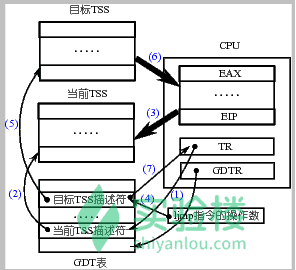

# 基于内核栈切换的进程切换 

## 实验目的

- 深入理解进程和进程切换的概念；
- 综合应用进程、CPU 管理、PCB、LDT、内核栈、内核态等知识解决实际问题；
- 开始建立系统认识。

## 实验内容

现在的 Linux 0.11 采用 TSS（后面会有详细论述）和一条指令就能完成任务切换，虽然简单，但这指令的执行时间却很长，在实现任务切换时大概需要 200 多个时钟周期。

而通过堆栈实现任务切换可能要更快，而且采用堆栈的切换还可以使用指令流水的并行优化技术，同时又使得 CPU 的设计变得简单。所以无论是 Linux 还是 Windows，进程/线程的切换都没有使用 Intel 提供的这种 TSS 切换手段，而都是通过堆栈实现的。

本次实践项目就是将 Linux 0.11 中采用的 TSS 切换部分去掉，取而代之的是基于堆栈的切换程序。具体的说，就是将 Linux 0.11 中的 `switch_to` 实现去掉，写成一段基于堆栈切换的代码。

本次实验包括如下内容：

- 编写汇编程序 `switch_to`：
- 完成主体框架；
- 在主体框架下依次完成 PCB 切换、内核栈切换、LDT 切换等；
- 修改 `fork()`，由于是基于内核栈的切换，所以进程需要创建出能完成内核栈切换的样子。
- 修改 PCB，即 `task_struct` 结构，增加相应的内容域，同时处理由于修改了 task_struct 所造成的影响。
- 用修改后的 Linux 0.11 仍然可以启动、可以正常使用。
- （选做）分析实验 3 的日志体会修改前后系统运行的差别。

## 实验报告

回答下面三个题：

#### 问题 1

针对下面的代码片段：

```
movl tss,%ecx
addl $4096,%ebx
movl %ebx,ESP0(%ecx)
```

回答问题：

- （1）为什么要加 4096；

  答：因为一页内存低地址存进程PCB，高地址是堆栈，linux-0.11 一页内存大小为4Kb,所以+4096。

- （2）为什么没有设置 tss 中的 ss0。

  答

#### 问题 2

针对代码片段：

```c
*(--krnstack) = ebp;
*(--krnstack) = ecx;
*(--krnstack) = ebx;
*(--krnstack) = 0;
```

回答问题：

- （1）子进程第一次执行时，eax=？为什么要等于这个数？哪里的工作让 eax 等于这样一个数？

  答：子进程第一次执行是eax =0;，为了让代码```if (!fork()) {....}```区分子进程和父进程。

- （2）这段代码中的 ebx 和 ecx 来自哪里，是什么含义，为什么要通过这些代码将其写到子进程的内核栈中？

  答：这段代码中的ebx和ecx是栈切换执行switch_to时压入的值，我觉得是为了切换进程时保护现场而压入的，在fork创建新进程（子进程）时添加这些代码进新进程内核栈是为了模拟父进程的内核栈。

- （3）这段代码中的 ebp 来自哪里，是什么含义，为什么要做这样的设置？可以不设置吗？为什么？

  答：ebp也是来自基于栈切换的switch_to（）时压入的，是当前进程在进行切换时保存当前进程现场的操作，为什么要这样设置呢？因为创建新的子进程当进程切换时需要pop所以这里是为了模拟父进程的内核栈.

#### 问题 3

为什么要在切换完 LDT 之后要重新设置 fs=0x17？而且为什么重设操作要出现在切换完 LDT 之后，出现在 LDT 之前又会怎么样？

答：因为需要重新设置fs对应的隐藏寄存器的段基址和段限长，所以需要重设操作，出现在LDT之前则没有任何意义不会有任何改变。


## TSS的切换

### TSS (task state segment)

The **task state segment (TTS)** is a structure on x86-based computers which holds information about a task, it is used by the operating system kernel for task managenment. specifically, the following information is stored in the TSS:

- processor register state
- I/O port permissions
- Inner-lever stack pointers (内部堆栈指针)
- Previous TSS link

All this information should be stored at specific locations within the TSS as specified in the IA-32 manuals.

### TR (task register).

The TR register is a 16-bit register which holds a segment selector for the TSS. It may be loaded through the LTR instruction. LTR is a privileged instruction and acts in a manner similar to other segment register loads. The task register has two parts: a portion visible and accessible by the programmer and an invisible one that is automatically loaded from the TSS descriptor.<br>


In the current Linux 0.11,the real completion of the  process switch is accomplished by the task state segment(Task State Segment,TSS for short).

Specifically, when designing the "Intel architecture"(that is the x86 system structure),

each task(process or thread) corresponds to an independent TSS. TSS is a  corresponds

to an independent TSS. TSS is a structure in memory that contains almost all CPU registers Image. There is a Task Register(TR for short) pointing to the TSS structure corresponding to the current process. 

The so-called TSS switch is copies almost all the registers in the CPU(current) to the TSS 

structure pointed  by TR.

At the same time a target TSS is found ,that is the TSS corresponding to the next process to be switched to, and the register image of TSS structure of next process  stored in CPU.

In here  the execution site switching  is completed.

as shown in the figure  blow:



Inter architecture provides the command ljmp to achieve the process switch .


The specific working process is:

- First, use the segment selector in TR to find the current TSS structure memory location in GDT table.
- second,  the register image of current CPU  store to the TSS structure memory  of finding before.(store the current site !)
- Now, we need to find the target process site and copy the register image of the target   process to the CPU. This just means we need to find TSS of the next process in  GDT table and copy the context of TSS structure memory to CPU.
- when the register image of TSS structure of the target process store in CPU completely, that means achieve switch to target process site, now, the target process becomes the current process. 
- Finally , TR should be changed to point to the location of the target TSS segment in the GDT table.<br>

all explain above  through one sentence execute  (ljmp segment selector : intra-segment offset).

So switch_to (a instruction) base on TSS for process and thread switching is actually a ljmp instruction：

```assembly
#define switch_to(n) {\
struct {long a,b;} __tmp; \
__asm__("cmpl %%ecx,current\n\t" \	 
	"je 1f\n\t" \
	"movw %%dx,%1\n\t" \
	"xchgl %%ecx,current\n\t" \
	"ljmp *%0\n\t" \
	"cmpl %%ecx,last_task_used_math\n\t" \
	"jne 1f\n\t" \
	"clts\n" \
	"1:" \
	::"m" (*&__tmp.a),"m" (*&__tmp.b), \
	"d" (_TSS(n)),"c" ((long) task[n])); \
}

#define FIRST_TSS_ENTRY 4

#define TSS(n) (((unsigned long) n) << 4) + (FIRST_TSS_ENTRY << 3))
```

Each process is divided into two part which correspond to TSS and LDT, respectively. 

TSS and LDT are both 64-bit(8 bytes).

so  _TSS(n) = n * 16 + 4 * 8 (bytes).

**ljmp instruction can be used in two ways, which are "ljmp $ segment selector, $ offset" and "ljmp * mem48" respectively. In here "ljmp *% 0" used the second way, "ljmp * mem48" mean jump to Logical address (48 bits) of the mem48 contain (mem48 also is an address), the hight 16 bits of 48 bits correspond to segment_selector, the low 32 bits of 48 bits correspond to offset. So ,the core of switch_to is ljmp 0 , n\*16+4\*8  **

**!! it is worth out attention:**

The '\*' of the "ljmp *mem48" is different from '\*' of C language . The '\*' of the "ljmp *mem48"  is mean indirect jump.


## 本次实验的内容

Although ，the task switching can be completed with one instruction, the execution time of the instruction is very long . It take almost 200 time cycles to complete the task switch using the ljmp instruction. if we want to increase the switching speed ,we can use the heap_stack switch instead of ljmp instruction.

Moreover. The use of heap_stack switching can also use the parallel optimization technology of instruction pipeline, while making design of the CPU simple.

Therefore, both Windows and Linux use the heap_stack switching technology to handle process switching.

Therefore rewriter the code of "switch_to" to  use the heap_stack switch instead of TSS is my task.

To achieve a process switch base on kernel , we need do three things :

1. Rewrite "switch_to"
2. Connect the rewritten "switch_to" and schedule() functions together.
3. Modify the current fork().

## schedule 与 switch_to

### modify shcedule()

The task of schedule( ) is finding the position "next" of the next process in the array.  The "next" is equal to "n" of the GDT table(TSS[n]=n\*16+4\*8).  if we get the "next" in the schedule function, we can use "switch_to (next)" function move to another process.

Now, we use heap_stack switching instead of TSS switching ,and so we need informations of  current process PCB 、target process PCB、current process kernel stack and target process kernel stack.

 The kernel stack of the Linux 0.11 process and the PCB of process are stored on the same page of memory (a 4kB size page of memory).The PCB is located at the low address of this page of memory ,and the stack is located at the high address of this page of memory.

In addition, since the PCB of the current process is pointed with a global variable "current", we  need to tell new switch_to () function a pointer to the target process PCB and we need to tell new switch_to function LDT(next) instead of TSS (next). Just mean ,we don't need TSS in each process now（we can delete code about TSS），but  also need LDT of  process.


In summary ,the current schedule() function (in kernel/sched.c) needs to be slightly modified, that is the following code:

```C
if ((*p)->state == TASK_RUNNING && (*p)->counter > c) 
    c = (*p)->counter, next = i; 

//......

switch_to(next);
```

modify:

```C
if ((*p)->state == TASK_RUNNING && (*p)->counter > c) 
    c = (*p)->counter, next = i, pnext = *p;

//.......

switch_to(pnext, _LDT(next)); 
```

### Rewrite switch_to()

Rewrite switch_to() function is the most important step in this experiment.

This function, in turn, completes the following functions:

- first, we need to handle the stack by the assembly language. just handle the ebp register.
- second, we need to compare the parameter of stack about the next process's PCB with the current process.
- third, we need in turn to complete PCB switch, rewrite kernel stack pointer of TSS, switch kernel stack, switch LDT and switch PC pointer (CS:EIP).

```assembly
switch_to:
    pushl %ebp
    movl %esp,%ebp
    pushl %ecx
    pushl %ebx
    pushl %eax
    movl 8(%ebp),%ebx
    cmpl %ebx,current
    je 1f
! 切换PCB
    ! ...
! TSS中的内核栈指针的重写
    ! ...
! 切换内核栈
    ! ...
! 切换LDT
    ! ...
    movl $0x17,%ecx
    mov %cx,%fs
! 和后面的 clts 配合来处理协处理器，由于和主题关系不大，此处不做论述
    cmpl %eax,last_task_used_math 
    jne 1f
    clts

1:    popl %eax
    popl %ebx
    popl %ecx
    popl %ebp
ret
```

**Switch PCB pointer**

ebx register is next process's PCB pointer.

The function of xchgl instruction  is to exchange contents between  two register.

```assembly
movl %ebx,%eax
xchgl %eax,current	
```

**Rewrite pointer of kernel stack stored in  TSS**

The current TSS is different from TSS before. Before TSS is a global array but current TSS is a global variable. We need to redefine TSS pointer through two sentences.

```
#define ESP0 =4
struct tss_struct *tss = (init_task.task.tss);
```

current TSS pointer ```tss``` similar current process pointer ```current```.

This has already discussed in detail before. In the system interrupt ,we need to find and determine the location of the kernel stack. and push the five register SS : ESP, CS: EIP and EFLAGS in user mode onto kernel stack. This is the key bridge between the user mode (user stack) and kernel mode (kernel stack). The key of find kernel stack position is use the TR register point to current TSS.

Although we don't need to use TSS for switch process in now.  We still stay the intel interrupt system. So we still need it that is we define global variable ```tss```. All processes share that variable.

```assembly
movl tss,%ecx
addl $4096,%ebx
movl %ebx,ESP0(%ecx)
```

ESP0 = 4 ,the ecx + ESP0 equal to position of kernel stack pointer in TSS (esp0).

```C
struct tss_struct {
	long	back_link;	/* 16 high bits zero */
	long	esp0;
	long	ss0;		/* 16 high bits zero */
	long	esp1;
	long	ss1;		/* 16 high bits zero */
	long	esp2;
	long	ss2;		/* 16 high bits zero */
	long	cr3;
	long	eip;
	long	eflags;
	long	eax,ecx,edx,ebx;
	long	esp;
	long	ebp;
	long	esi;
	long	edi;
	long	es;		/* 16 high bits zero */
	long	cs;		/* 16 high bits zero */
	long	ss;		/* 16 high bits zero */
	long	ds;		/* 16 high bits zero */
	long	fs;		/* 16 high bits zero */
	long	gs;		/* 16 high bits zero */
	long	ldt;		/* 16 high bits zero */
	long	trace_bitmap;	/* bits: trace 0, bitmap 16-31 */
	struct i387_struct i387;
};
```

**switch kernel stack :**

It's also simple to complete the kernel stack switch. we just need to store value of esp register of the current process  onto the current PCB , and take corresponding esp value of next PCB out and put it into esp register.

since Linux -0.11  didn't define the variable of kernel stack pointer in PCB(task_struct). so we need to add a variable ```kernelstack``` to Linux-0.11 PCB, we still need define another variable ``` KERNEL_STACK = 12```  for determine variable of  ```kernelstack``` position in PCB.

**Why KERNEL_STACK equal to 12 ?**

because the kernel code have many  assembly hardcodes about manipulating this structure, so,if we add the variable ```kernelstack``` in other position, we need to modify kernel code in many difference place. 

```C
KERNEL_STACK = 12
movl %esp,KERNEL_STACK(%eax)	! 保存上一个进程的栈顶指针
! 再取一下 ebx，因为前面修改过 ebx 的值,此时eax的值等于上一个进程的PCB指针
movl 8(%ebp),%ebx	
movl KERNEL_STACK(%ebx),%esp	！取下个进程的栈顶指针放入esp
```

task_struct:

```C
// 在 include/linux/sched.h 中
struct task_struct {
    long state;
    long counter;
    long priority;
    long kernelstack;
//......
```

because we modify the PCB structure,  we also need to modify initialization code of 0 process PCB structure .Modify ```#define INIT_TASK { 0,15,15, 0,{ { },},0,...```  to ``` #define INIT_TASK { 0,15,15,PAGE_SIZE+(long)&init_task, 0,{ { },},0,...```

**switch LDT**

```assembly
movl 12(%ebp),%ecx
lldt %cx
!上面使改LDT代码
movl $0x17,%ecx
mov %cx,%fs
```

Why we have to add two code ```movl $0x17,%ecx``` ``` mov %cx,%fs``` behind that code of switch LDT.

because we need to change the segment base address and segment length limit in the hidden register about fs.

Examlpe with CS. The hidden register for increase CPU processing speed.


**switch PC （switch to next process）**

```assembly
1:    popl %eax
    popl %ebx
    popl %ecx
    popl %ebp
ret
```

**kernel stack  now**


Execute those codes to turn to the next process,if it isn't come here through code ```je 1f```. Because we have been changed the kernel stack before. we ```pop  (eax ,ebx,ecx,ebp) ``` is register of next process.   ret instruction equal to ```pop IP```.So we execute ```ret``` turn to schedule() function tail of next process. Now ! we completed the stack switch perfectly.

## modify fork()

**Why we need to modify fork() function ?**

**Because, we need to simulate the parent process's kernel stack for the newly created child process. **

Now, we need to modify the fork() function. it is to associate the process's user stack, user program to its kernel stack with SS: ESP, CS: IP, which is pushed in the kernel stack.

In addition, since fork() function-core is let the child process to use code, data, and stack of the parent process . the fork core has not changed, although we use the stack switching.


Don't hard to imagine. modify fork which  mean  initialize child process's kernel stack. In ```copy_process () ```as the core code of ```fork ()```, it used to apply a page of memory as process PCB. The kernel stack address position equal pointer p position add the one page of memory size.  so the code ```krnstack = (*long)(PAGE_SIZE + (long)p)``` can find the child process kernel stack position. next step is to initialize the content of krnstack pointer .

```C
/*modify in fork()*/
long *krnstack;
p = (struct task_struct *) get_free_page();
krnstack = (long)(PAGE_SIZE +(long)p);
 *(--krnstack) = ss & 0xffff;
 *(--krnstack) = esp;
 *(--krnstack) = eflags;
 *(--krnstack) = cs & 0xffff;
 *(--krnstack) = eip;
 *(--krnstack) = ds & 0xffff;
 *(--krnstack) = es & 0xffff;
 *(--krnstack) = fs & 0xffff;
 *(--krnstack) = gs & 0xffff;
 *(--krnstack) = esi;
 *(--krnstack) = edi;
 *(--krnstack) = edx;
 *(--krnstack) = (long)first_return_from_kernel;
 *(--krnstack) = ebp;
 *(--krnstack) = ecx;
 *(--krnstack) = ebx;
 *(--krnstack) = 0;
 p->kernelstack = krnstack;
 ......

```

Those code for simulate parent kernel stack for child process! 

Make a attention !

```c
*(--krnstack) = (long)first_return_from_kernel;
*(--krnstack) = 0;
```

We need to code a first_return_from_kernel as a mark! If we return to address first_return_from_kernel. We need to execute those code following.

```assembly
/*modify in system_call.s*/
.align 2
first_return_from_kernel:
popl %edx
popl %edi
popl %esi
pop %gs
pop %fs
pop %es
pop %ds
iret
```

instruction ```iret``` equal to 

```assembly
pop eip
pop cs
pop eflags
pop esp
pop ss
```

 instruction ```*(--krnstack) = 0;```  Means eax =0 for distinguish parent process and child process.

**In the end , don't forget add the two code following to corresponding .c file **

```C
extern void first_return_kernel(void); // in the fork()
extern long switch_to(struct task_struct *p , unsigned long _ldt); // in the sched.c
```

## Modify step

**Modify in system_call.s**

Write the switch_to、first_return_from_kernel、etc in the system_call.s**

```assembly
# Don't forget to change the hardcode.
# Because I forget to change the hardcode , I stayed here so long time.
state	= 0		# these are offsets into the task-struct.
counter	= 4
priority = 8
KERNEL_STACK = 12
signal	= 16
sigaction = 20		# MUST be 16 (=len of sigaction)
blocked = (33*16+4)

# Define as a global variable，can be used in other file with the keyword extern declaration.
.globl first_return_from_kernel, switch_to 
.align 2
switch_to:
	pushl %ebp
	movl %esp, %ebp
	pushl %ecx
	pushl %ebx
	pushl %eax 
	movl 8(%ebp), %ebx 
	cmpl %ebx, current 
	je 1f
	movl %ebx, %eax
	xchgl %eax, current # eax=old_current, so current=pnext
	movl tss, %ecx		# ecx = tss of pnext, it also the new current
	addl $4096, %ebx	# ebx=the top of current kernel stack(pnext)
	movl %ebx, 4(%ecx)
	movl %esp, KERNEL_STACK(%eax)
	movl 8(%ebp), %ebx 
	movl KERNEL_STACK(%ebx), %esp
	movl 12(%ebp), %ecx
	lldt %cx
	movl $0x17, %ecx
	mov %cx, %fs
	cmpl %eax, last_task_used_math	
	jne 1f
	clts
1:  popl %eax
	popl %ebx
	popl %ecx
	popl %ebp
	ret
.align 2
first_return_from_kernel:
	popl %edx
	popl %edi
	popl %esi
	pop %gs
	pop %fs
	pop %es
	pop %ds
	iret
```

**Modify sched.h **

```C
struct task_struct {
/* these are hardcoded - don't touch */
	long state;	/* -1 unrunnable, 0 runnable, >0 stopped */
	long counter;
	long priority;
	long kernelstack;
	long signal;
	struct sigaction sigaction[32];
	long blocked;	/* bitmap of masked signals */
    ......
}
#define INIT_TASK \
/* state etc */	{ 0,15,15,PAGE_SIZE+(long)&init_task, \
/* signals */	0,{{},},0, \
.................................

 /*注释掉
#define switch_to(n) {\
struct {long a,b;} __tmp; \
__asm__("cmpl %%ecx,current\n\t" \
	"je 1f\n\t" \
	"movw %%dx,%1\n\t" \
	"xchgl %%ecx,current\n\t" \
	"ljmp *%0\n\t" \
	"cmpl %%ecx,last_task_used_math\n\t" \
	"jne 1f\n\t" \
	"clts\n" \
	"1:" \
	::"m" (*&__tmp.a),"m" (*&__tmp.b), \
	"d" (_TSS(n)),"c" ((long) task[n])); \
}
*/
  
```

**Modify sched.c**

```C
extern long switch_to(struct task_struct *p , unsigned long _ldt);
struct tss_struct * tss = &(init_task.task.tss);
void schedule(void)
{
	int i,next,c;
	struct task_struct ** p;
	struct task_struct *pnext = &(init_task.task);

/* check alarm, wake up any interruptible tasks that have got a signal */

	for(p = &LAST_TASK ; p > &FIRST_TASK ; --p)
		if (*p) {
			if ((*p)->alarm && (*p)->alarm < jiffies) {
					(*p)->signal |= (1<<(SIGALRM-1));
					(*p)->alarm = 0;
				}
			if (((*p)->signal & ~(_BLOCKABLE & (*p)->blocked)) &&
			(*p)->state==TASK_INTERRUPTIBLE)
				(*p)->state=TASK_RUNNING;
		}

/* this is the scheduler proper: */

	while (1) {
		c = -1;
		next = 0;
		i = NR_TASKS;
		p = &task[NR_TASKS];
		while (--i) {
			if (!*--p)
				continue;
			if ((*p)->state == TASK_RUNNING && (*p)->counter > c){
				c = (*p)->counter, next = i;
				pnext = *p;
			}
		}
		if (c) break;
		for(p = &LAST_TASK ; p > &FIRST_TASK ; --p)
			if (*p)
				(*p)->counter = ((*p)->counter >> 1) +
						(*p)->priority;
	}
	switch_to(pnext,_LDT(next));
}
```

**Modify fork()**

```C
extern void first_return_kernel(void);  

int copy_process(int nr,long ebp,long edi,long esi,long gs,long none,
		long ebx,long ecx,long edx,
		long fs,long es,long ds,
		long eip,long cs,long eflags,long esp,long ss)
{
	struct task_struct *p;
	int i;
	struct file *f;

	p = (struct task_struct *) get_free_page();
	if (!p)
		return -EAGAIN;
	task[nr] = p;
	*p = *current;	/* NOTE! this doesn't copy the supervisor stack */
	p->state = TASK_UNINTERRUPTIBLE;
	p->pid = last_pid;
	p->father = current->pid;
	p->counter = p->priority;
	long * krnstack ;
	krnstack = (long *) (PAGE_SIZE + (long) p);
    *(--krnstack) = ss & 0xffff;
    *(--krnstack) = esp;
    *(--krnstack) = eflags;
    *(--krnstack) = cs & 0xffff;
    *(--krnstack) = eip;
 *(--krnstack) = ds & 0xffff; 
   *(--krnstack) = es & 0xffff; 
   *(--krnstack) = fs & 0xffff; 
 *(--krnstack) = gs & 0xffff;
  *(--krnstack) = esi; 
 *(--krnstack) = edi; 
    *(--krnstack) = edx;
	*(--krnstack) =(long) first_return_kernel;
    *(--krnstack) = ebp;
    *(--krnstack) = ecx;
    *(--krnstack) = ebx;
    *(--krnstack) = 0;
	p->kernelstack = krnstack;
	p->signal = 0;
	p->alarm = 0;
	p->leader = 0;		/* process leadership doesn't inherit */
	p->utime = p->stime = 0;
	p->cutime = p->cstime = 0;
	p->start_time = jiffies;
	p->tss.back_link = 0;
	p->tss.esp0 = PAGE_SIZE + (long) p;
	p->tss.ss0 = 0x10;
	p->tss.eip = eip;
	p->tss.eflags = eflags;
	p->tss.eax = 0;
	p->tss.ecx = ecx;
	p->tss.edx = edx;
	p->tss.ebx = ebx;
	p->tss.esp = esp;
	p->tss.ebp = ebp;
	p->tss.esi = esi;
	p->tss.edi = edi;
	p->tss.es = es & 0xffff;
	p->tss.cs = cs & 0xffff;
	p->tss.ss = ss & 0xffff;
	p->tss.ds = ds & 0xffff;
	p->tss.fs = fs & 0xffff;
	p->tss.gs = gs & 0xffff;
	p->tss.ldt = _LDT(nr);
	p->tss.trace_bitmap = 0x80000000;
	if (last_task_used_math == current)
		__asm__("clts ; fnsave %0"::"m" (p->tss.i387));
	if (copy_mem(nr,p)) {
		task[nr] = NULL;
		free_page((long) p);
		return -EAGAIN;
	}
	for (i=0; i<NR_OPEN;i++)
		if ((f=p->filp[i]))
			f->f_count++;
	if (current->pwd)
		current->pwd->i_count++;
	if (current->root)
		current->root->i_count++;
	if (current->executable)
		current->executable->i_count++;
	set_tss_desc(gdt+(nr<<1)+FIRST_TSS_ENTRY,&(p->tss));
	set_ldt_desc(gdt+(nr<<1)+FIRST_LDT_ENTRY,&(p->ldt));
	p->state = TASK_RUNNING;	/* do this last, just in case */
	return last_pid;
}
```

