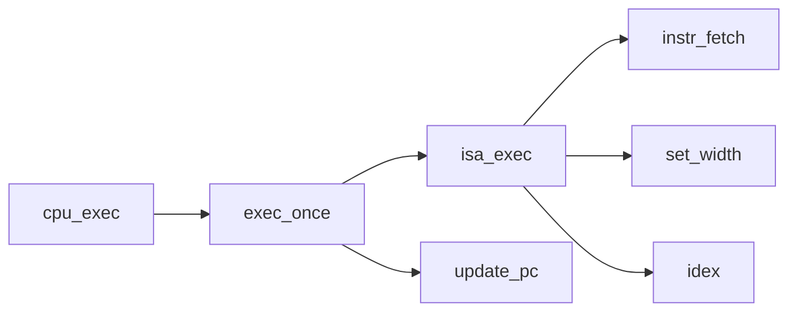

**1.RTFSC 请整理一条指令在NEMU中的执行过程. (我们其实已经在PA2.1阶段提到过这道题了)**<br>
	程序在nexus-am中被交叉编译成二进制指令被装入NEMU的内存中，NEMU通过一系列函数来取指令，解码指令，执行指令<br>
函数调用历程如图:<br>



以指令0x00为例cpu执行模拟函数cpu_exec一路执行到instr_fetch在内存中取出指令0x00然后查询*NEMU模拟器中存储的符合x指令集规范的表opcode_table(需要我们手动实现)*得到对应的0x00这一条指令的执行宽度,opcode_table[0x00].width,调用宽度设置函数set_width设置宽度,然后进入idex函数运行对应的内置解码程序opcode_table[0x00].decode,和指令对于的内置执行程序opcode_table[0x00].execute,最后调用update_pc函数，更新pc寄存器.<br>
	
**2.编译与链接 在nemu/include/rtl/rtl.h中, 你会看到由static inline开头定义的各种RTL指令函数. 选择其中一个函数, 分别尝试去掉static, 去掉inline或去掉两者, 然后重新进行编译, 你可能会看到发生错误. 请分别解释为什么这些错误会发生/不发生? 你有办法证明你的想法吗?**<br>

**static:**<解释来自stackoverflow><br>
-	1. Static defined **local** variables do not lose their value between function calls. In other words they are global variables, but scoped to the local function they are defined in.<函数内定义的变量用static关键字修饰就会被编译器放入静态存储区，应该是被放在.data表内，其实就相当于一个另类的全局变量了.>
-	2. A static **global** variable or a function is "seen" only in the file it's declared in.<字面意思>

**inline:**<br>
每次函数调用都要执行押入参数，保存返回地址，保存寄存器等工作会让函数调用变慢,inline的作用有点像define,可以将代码直接展开到调用处直接执行就可以让函数调用变快，但是缺点是这个操作可能让可执行文件变得更大或者更小无法预测<br>

有了这些基础现在开始回答问题:<br>
-	1. 去掉inline:<br>

static 和 static inline 其实没有很大的不同,只是函数的调用方式改变了,但是我试图编译时出现了这个错误:

```c
./include/rtl/rtl.h:138:14: error: ‘rtl_sext’ defined but not used [-Werror=unused-function]
 static  void rtl_sext(rtlreg_t* dest, const rtlreg_t* src1, int width) {
              ^~~~~~~~
```

原因是我们在gcc中加入了-Werror把所有的警告都当成error来处理,把-Werror去掉就可以了<br>
-	2. 去掉static:<br>
因为有inline关键字的存在所以，程序就像define一样会在调用处展开所以定义在头文件中的无static有inline的函数不会出现多次定义,只要把makefile文件中的-Werror去掉就可以编译链接成功<br>

-	3.去掉static inline:<br>
因为头文件会被许多文件引用所以如果去掉static inline,这个函数就会被多次定义，在链接的时候会报一下错误:<br>

```c
+ LD build/x86-nemu
build/obj-x86/isa/x86/decode/decode.o: In function `rtl_setrelopi':
/home/oeoe/Documents/ICS-PA-2019/nemu/./include/rtl/rtl.h:145: multiple definition of `rtl_setrelopi'
```

**3.编译与链接**
- 1. 在nemu/include/common.h中添加一行volatile static int dummy; 然后重新编译NEMU. 请问重新编译后的NEMU含有多少个dummy变量的实体? 你是如何得到这个结果的?**
- 2. 添加上题中的代码后, 再在nemu/include/debug.h中添加一行volatile static int dummy; 然后重新编译NEMU. 请问此时的NEMU含有多少个dummy变量的实体? 与上题中dummy变量实体数目进行比较, 并解释本题的结果.**
- 3. 修改添加的代码, 为两处dummy变量进行初始化:volatile static int dummy = 0; 然后重新编译NEMU. 你发现了什么问题? 为什么之前没有出现这样的问题? (回答完本题后可以删除添加的代码.)**


**Volatile tells the compiler not to optimize anything that has to do with the volatile variable. <来自stackoverflow><br>**

1. 答案是74个，在build/obj中利用`grep  -r -c  'dummy' ./* | grep '\.o:[1-9]'| wc -l`命令得出.
2. 答案仍然是74个.
3. 两个初始化后会出现多次定义的错误:<br>
 
```c
./include/common.h:2:21: note: previous definition of ‘dummy’ was here
 volatile static int dummy=0;
                     ^~~~~
In file included from ./include/device/map.h:4:0,
                 from src/memory/memory.c:2:
./include/common.h:2:21: error: redefinition of ‘dummy’
```

原因是强弱定义的问题，当两个dummy都没有初始化的时候dummy是一个弱符号,编译器不会报错,编译器会选择占用内存最大的那个弱符号，当把两个dummy都初始化后，两个dummy就变成强符号了，链接器不允许强符号被多次定义，如果一个是强符号一个是弱符号，那么弱符号会被强符号覆盖(当然这个弱符号的占用内存大小不能大于强符号，否则会报错).<br>

**4. 了解Makefile 请描述你在nemu/目录下敲入make 后, make程序如何组织.c和.h文件, 最终生成可执行文件nemu/build/$ISA-nemu. (这个问题包括两个方面:Makefile的工作方式和编译链接的过程.) 关于Makefile工作方式的提示:**<br>
- 1. Makefile中使用了变量, 包含文件等特性
- 2. Makefile运用并重写了一些implicit rules
- 3. 在man make中搜索-n选项, 也许会对你有帮助

```makefile
NAME = nemu
#如果$(MAKECMDGOALS)和clean）不相等则执行ifneq ...endif内的语句
#$MAKECMDGOALS是一个特殊参数:这个参数存放你在命令行指定的目标列表,如果什么都没指定则为空
ifneq ($(MAKECMDGOALS),clean) # ignore check for make clean
# ?=用来设置变量，当没有设置ISA值或者没有ISA这个变量的时候
ISA ?= x86
#相当于执行一条shell命令
ISAS = $(shell ls src/isa/)
#打印信息到标准输出
$(info Building $(ISA)-$(NAME))
#$(filter pattern…,text):
#Returns all whitespace-separated words in text that
#do match any of the pattern words, removing any words that do not match. 
ifeq ($(filter $(ISAS), $(ISA)), ) # ISA must be valid
#产生致命错误，并提示Invalid ISA. Supported: $(ISAS)给用户
$(error Invalid ISA. Supported: $(ISAS))
endif
endif

INC_DIR += ./include ./src/isa/$(ISA)/include
BUILD_DIR ?= ./build

#如果SHARE的值不为空就为true
ifdef SHARE
SO = -so
# -D_SHARE:-Dmacro=defn  相当于 C 语言中的 #define macro=defn
# -fPIC:生成位置无关代码
SO_CFLAGS = -fPIC -D_SHARE=1
SO_LDLAGS = -shared -fPIC
endif

OBJ_DIR ?= $(BUILD_DIR)/obj-$(ISA)$(SO)
BINARY ?= $(BUILD_DIR)/$(ISA)-$(NAME)$(SO)

#类似C中的#include
include Makefile.git
#设置默认目标，如果没有在命令行指定目标则使用默认目标
.DEFAULT_GOAL = app

# Compilation flags
CC = gcc
LD = gcc
#$(addprefix,prefix,names...):The value of prefix is prepended to the front of 
# each individual name and the resulting larger names are concatenated with single
# spaces between them 
INCLUDES  = $(addprefix -I, $(INC_DIR))
# -O2:允许编译器对代码进行优化,级别为2
# -MMD:生成文件关联信息但是忽略由#include<file>造成的依赖关系并且写入filename.d文件中，可以去看看-M
# -Wall:开启所有警告信息
# -Werror: every warning is treated as an error
# -ggdb3:(搞不懂是什么意思)produces extra debugging information, for example: including macro definitions.
# -D__ISA__:-Dmacro=defn  相当于 C 语言中的 #define macro=defn
# -fomit-frame-pointer :(这个参数有关于栈指针)看这篇文章:https://stackoverflow.com/questions/14666665/trying-to-understand-gcc-option-fomit-frame-pointer
CFLAGS   += -O2 -MMD -Wall -Werror -ggdb3 $(INCLUDES) -D__ISA__=$(ISA) -fomit-frame-pointer

QEMU_DIFF_PATH = $(NEMU_HOME)/tools/qemu-diff
QEMU_SO = $(QEMU_DIFF_PATH)/build/$(ISA)-qemu-so

#执行make指令$(MAkE)是特殊变量 -C用来指定目录
$(QEMU_SO):
	$(MAKE) -C $(QEMU_DIFF_PATH)

# Files to be compiled
# -v 表示不匹配“isa"
SRCS = $(shell find src/ -name "*.c" | grep -v "isa")
SRCS += $(shell find src/isa/$(ISA) -name "*.c")
#$(var:a=b)，是将 var 变量中每一个单词后面的 a 替换为 b
OBJS = $(SRCS:src/%.c=$(OBJ_DIR)/%.o)

# Compilation patterns
#@表示不显示执行的指令
#$<代表第一个依赖项
#$(dir NAMES...):取出每个文件名的目录部分
$(OBJ_DIR)/%.o: src/%.c
	@echo + CC $<
	@mkdir -p $(dir $@)
	@$(CC) $(CFLAGS) $(SO_CFLAGS) -c -o $@ $<


#看这篇文章https://blog.csdn.net/xiaozhi_su/article/details/4202779
# Depencies
#将OBJS中的文件后缀为.o的文件然后把后缀改为.d
-include $(OBJS:.o=.d)

# Some convenient rules

.PHONY: app run gdb clean run-env $(QEMU_SO)
app: $(BINARY)

override ARGS ?= -l $(BUILD_DIR)/nemu-log.txt
override ARGS += -d $(QEMU_SO)

# Command to execute NEMU
IMG :=
NEMU_EXEC := $(BINARY) $(ARGS) $(IMG)

$(BINARY): $(OBJS)
	$(call git_commit, "compile")
	@echo + LD $@
	@$(LD) -O2 -rdynamic $(SO_LDLAGS) -o $@ $^ -lSDL2 -lreadline -ldl

run-env: $(BINARY) $(QEMU_SO)

run: run-env
	$(call git_commit, "run")
	$(NEMU_EXEC)

gdb: run-env
	$(call git_commit, "gdb")
	gdb -s $(BINARY) --args $(NEMU_EXEC)

clean:
	-rm -rf $(BUILD_DIR)
	$(MAKE) -C tools/gen-expr clean
	$(MAKE) -C tools/qemu-diff clean
count:
	@echo  "\e[1;32m"
	@echo "The .c and .h file total number of row equal to :"
	@find ./ -name "*.[ch]" | xargs wc -l | awk 'END{printf "%s\n",$$1}'
	@echo "The .c and .h file (without blank line) total number of row equal to :"
	@find ./ -name "*.[ch]" | xargs cat | grep -v '^\s*$$'| wc -l
	@echo "\e[0m"


```
