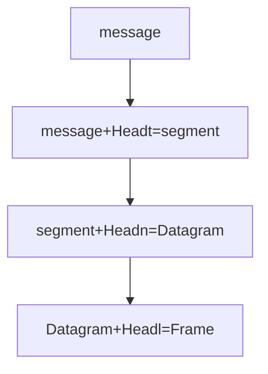

 关于计算机网络自顶向下的第一章的问题回答
-------
**R1:主机和终端系统有什么不同？<br>**
终端系统（end system）和主机(host)系统其实没有很大的区别都就具有连接网络和交换信息的能力，本质上没有很大的区别．但是在现实生活中主机常常指提供服务的一方，而终端指手机，手提电脑，台式电脑之类的．<br>
**R2:protocol在维基百科上的定义<br>**
protocol（协议）在维基百科上的定义是：给数据/信息在电子通信和网络上的传输制定的规则<br>
**R3:为什么协议（protocol）如此重要？<br>**
protocol由Internet engineering task force(IETF)制定，为了提供更好的更加有质量，更加安全的协议来给消费者使用，标准协议为了每个用户之间能够更有效的互相交流．例如：书上说的人打招呼的例子，如果没有协议就会乱套．<br>
**R4:列出６个访问技术，以及将其分类家庭访问，企业访问和广域无线访问<br>**
*家庭访问：<br>*
1.DSL(digtal subscriber line):数字订阅通路<br>
2.cable internet access: 有线上网，也可以叫做HFC(hybird fiber coax)：混合光纤同轴电缆<br>
3.fiber to the home: 光纤到家（光纤）<br>
4.Dial_up :数字拨号（用电话线<br>
5.satellite:卫星<br>
*企业访问（家庭其实也可以）:<br>*
6.WIFI<br>
7.Enternet<br>
广域无线访问：
8.third/(fouth)-generation(3G)<br>
9.LTE(long-term-Evolution)<br>
**R5:HFC的传输速度是用户独享还是分享？是否可能在HFC的下游发生数据碰撞？<br>**
HFC(hybird fiber coax)混合光纤同轴电缆也就是cable internet access有线连接，用的是电视公司提供的有线电视的电视线连接，因为这个互联网访问方式中用到了两种电缆线分别是光纤和同轴电缆，所以就叫HFC．
如图所示HFC是用户分享类型的，如图HFC的下载源只有一个所以downstream不冲突，但是上传（upstream）就有可能冲突，需要用协议来解决．<br>
**R6:列出你所在城市的住宅访问技术（access technologies）,以及它们各种的下载，上传速度和价钱.**
目前中国电信能够提供基于ADSL、LAN以及FTTH光纤接入三种技术的宽带实现方式。速率从1Mbps到20Mbps不等，价格也从119到559不等。(抄的．．)<br>
**R7:以太局域网（Enthernet LANs）的传输速度是多少？**<br>
对于用户：通常有100Mbps,对于服务器：通常有１Gbps~10Gbps .<br>

**R8:Enthernet（以太网）运行的物理介质是什么，有那些？**<br>
有同轴电缆（coaxial cable）光纤（fiber optic）,双绞铜线（twisted-pair-copper Wire).<br>
**R9:提供Dial-up modems,DSL,HFC,FTTH的速度范围和判断其是用户独占还是用户共享**<br>
- DSL:上传速度：2.5Mbps，下载速度：24Mbps.[2003]
- HFC:上传速度：30.7Mbps,下载速度：42.8Mbps.[DOCSIS.2.0]
- FTTH:理论上可以达到１Gbps实际平均下载速度可以达到20Mbps[2011]
- Dial-up modems: 56kbps [巨慢]<br>

**R10:描述现在最流行的无线连接技术，并且比较它们的差异**<br>
最流行的无线连接技术:现在是WIFI和4G<br>
差异：<br>
WIFI是用户无线或有线连接到自己附近的路由器，通过路由器这个接入点连接网络如图：
<br>
一般WIFI的范围是10米之内．WIFI提供的理论接入速度可以达到600Mbps(来自知乎，书上是54Mbps).<br>
4G:4G用的是蜂窝技术（cellular telephony),4G提供的理论接入速度是100 Mbps,而且蜂窝技术的范围可以达到10千米内（范围更大）.<br>
**R11:假设有只有一个分组交换机(parket switch)在发送端和接收端之间，传输速度发送端到分组交换机为R1,分组交换机到接收端之间为R2,假设使用的是存储转发交换机制(store-and-forward packet switch),计算端到端的总延迟[忽略处理延迟(processing delay),队列延迟(queuing delay),传播延迟（propagation delay）]**<br>
那总延迟就等于这段路上的传输延迟（transmission delay）=R1+R2.<br>

**R12:电路交换网络(circuit-switched network)相比分组交换网络(packet-switch network)有什么优势，在电路交换网络中，TDM对比FDM有什么优势**<br>
我觉得电路交换网络系统的缺点也可以算是它的优点，因为其在传输信息时需要建立连接状态（circuit）这个时候用户可以用这条链路上的所有的速度，但是此时其他的用户无法使用，此时如果建立链路没有在传输信息而是待工，这个时候链路资源就没办法有效利用，这就是circut-switch network的缺点，但是如果其的应用场景使用链路的密度很大，这个时候就很OK,因为其传输速度是满的．<br>
TDM(Time-Division Multiplexing)时分复用对比FDM(Frequency-Division Multiplexing)频分复用的优势：<br>
```
 TDM is relatively a newer technique used for digital signals.
 TDM advantage over FDM is that it offers bandwidth saving with
 ATDM (allocate time slots on demand dynamically) and 
 there is low interference between the signals that are being
 multiplexed(from google)
``` 
**R13:假设用户分享2Mbps的带宽，同时假设每个用户在传输数据是持续以1Mbps的带宽，链接网络时传输的占的时间与总时间的比值为20%**　<br>
**a.如果使用电路交换网络(circuit-switched network),可以支持多少用户使用.** <br>
**b.假设使用分组分配，两个或者更少用户同时传输数据的时候为什么实际上没有队列（排队）延迟，三个用户同时使用为什么会有队列延迟**<br>
**c.计算用户正在传输的概率**<br>
**d.假定现在有三个用户计算这个三个用户同时使用链路的概率，找到队列增长的概率**(c.d应该是承接b)<br>

1.两个用户可以同时使用<br>
2.因为两个或者更少用户用的时候没有超过链路的最大带宽，而三个以上用户就会超过，所以用分组分配就会有队列延迟．<br>
3.用户真正传输的概率是20%<br>
4.三个用户同时使用的概率是$1\over5$ $\times$ $1\over5$ $\times$ $1\over5$ $=$ $1\over125$,队列增长的概率也是 $1\over125$<br>
**R14:为什么处于同一个层级的ISPs互相对等，IXP是怎么赚钱的？**<br>
一个城市与临近的另一个城市需要的用户需要数据传输如果这两个城市的ISPs没有进行对等(peer),则还需要通过更上一层的ISPs来达到互相连接，而更高一层的ISPs就会向低级的ISPs收费（收费的多少体现在流量上），对等（peer）了之后就不用通过更上一层ISPs,以达到节省开支的目的，而IXP(Internet Exchange Point)，IXP通常由电信公司以外的第三方公司来建立，主要作为ISPs的对接点，提供ISPs的对等服务．IXP赚钱通过想ISPs们收取少量的端口费盈利．<br>

**R15:一些内容的提供者也建立了它们自己的网络，描述一下Google,是什么促进它们建立自己的网络？**<br>
google通过自己提供的TCP/IP网络把它分布在全球的大的小的数据中心连接起来（大的数据中心可能连接上百万个用户，小的可能几百个用户），
这些数据中心大多都是连接比较底层的用户或者ISPs提供，可以让谷歌绕过更高层级的ISPs．<br>
促进他们建立自己网络的理由是：内容提供商（例如谷歌）建立自己的网络服务可以减少向上层ISPs支付费用，（因为谷歌可以直接和用户相连，或者连接更下层的ISPs和IXP,所以减少了中间ISPs的数量），同时也可以达到对用户更好的控制．<br>
**R16:考虑在固定线路上从源主机发送一个包（packet）到目标主机，列出端到端的延迟，以及表示出那个延迟是常数，那个延迟是变量．**<br>
分别有传输延迟（transmission delay），传播延迟(propagation delay)，队列延迟(queueing delay)，处理延迟(processing delay).<br>
队列延迟是可变的，其他延迟是常数．<br>
**R17:去这个小程序网站：Transmission Versus Propagation Delay，通过调整rates,propagation delay和packet sizes的大小，找到两个组合，使packet在源主机传输完成之前，第一个被发送的bit到达目标主机，和pakect在源主机完成传输之后，第一个被发送的bit才到达目标主机．**<br>第一个组合是：1000KM,1Mbps,100bytes.
第二个组合是：100KM,1Mbps,100bytes.<br>
**R18:发送长度为1000bytes的packet,距离为2500Km,传播速度是$2.5$x$10^8$m/s,传输速度是2Mbps需要多长时间,更加抽象一点，发送长度为L的packet,距离为d,传播速度是s,传输速度是Rbps需要多长时间,在传递信息中的延迟是由打包的数据长度决定？还是传输的速度决定？**
假设忽略了处理延迟和队列延迟，那么需要的时间为<br>
$1000\div(2000000\div8)+2500\times 1000 \div(2.5\times10^8)=0.01+0.004=0.014s=14msec$<br>
抽象一点：
$time=L\times8/R+d/s$ <br>
打包的数据长度和传输速度都不能呢个决定延迟大小．<br>
**R19:假设源主机Ａ想传递一个很大的文件给目标主机Ｂ，在两者直接有三条链路，速度分别为R1=500kbps,R2=2Mbps,R3=1Mbps.**<br>
- 假设没有其他的流量在网络中，这个文件传输的吞吐量是多少？
- 假设文件大小为4Mbytes,大致需要多长时间传输这个文件．
- 重算1,2题现在R2降低到100kbps.<br>
1.这个文件的吞吐量由最小的通路决定，文件吞吐量为500Kbps.<br>
2.$T=4000000\div(500\times1000\div 8)=64s$<br>
3.如果R2降为100kbps,文件传输的吞吐量为100kbps,则4Mbytes的文件传输大致时间为$4000000\div(100\times1000\div8)=320s$<br>


**R20:假设一个很大的文件从主机A传输到主机B,从一个比较高的角度描述一下主机A如何把一个文件变成一个个的packet，当一个packet到达交换机（switch）,哪些信息被用来指引（确定）packet前进路线，以及为什么互联网中分组交换需要模拟汽车从一个城市到另外一个城市并沿着路线不断问路的过程．**<br>
<br>
主机Ａ的文件本来是一个整体在层级结构中被称作消息(message),传递给下面的传输层（Transport layer),传输层中的TCP协议可以把message分割成一块一块加上一些信息放在每一块上组成段(segment),同时TCP协议拥有流控制（flow control）功能[匹配发生者和接受者的速度]，和拥堵控制机制（congestion-control mechanism),然后传递给网络层（Network layer),然后把段传到网络层(Network layer),网络层执行的是IP协议，以及一些路由协议（routing protocol）,同样是在每个段的头部加上一些信息组成数据报(Datagram),然后在传递给链路层（Link layer）,链路层用的协议不同链路上用的协议就不同，有：WIFI,Ethernet and cable network的DORSIS protocol,操作也是在数据报头部加入一些信息形成的桢（Frame）最后就是送到物理层（physical layer),物理层就把每一个桢中的数据一个bit一个bit的传播出去，物理层同样有协议，根据使用的物理介质的不同而不同．<br>
一个packet到达交换机后根据每个packet中的IP地址找到前进路线．<br>
第三问着实不懂．<br>

**R21:去执行Queuing and Loss这个小程序,然后找到最大发送速率和最小的传输速率是多少？对于这些速率，流量强度是多少？用这些速率运行该小程序并确定出现丢包要花费多长时间？然后第多次重复该实验，再次确定出现丢包花费多长时间。这些值有什么不同？为什么会有这种现象？**<br>
最大的发射速度是500packet/s,最小的传输速度是350packet/s,对于这些流量强度是$500\div350=1.428$用这些速度去运行，出现丢包的时间大约在31~34秒左右，并不能确定具体哪个时间会发生丢包，为什么？因为用户发生数据包有随机性，我们并不能控制每一个用户．


**R22:列出一层都可以执行5个任务,并且是否有可能这些任务中有可以执行在两个或者多个层？**<br>
任务: 封装本层的报文段, 设置各种参数, 对接受到的报文段进行差错检查, 还可能进行流量设置, 分组重组等等.多个层是可能执行相同的一个(或两个)任务的, 比如差错检验<br>
**R23:互联网协议栈的五层是什么，每一层的的主要职责是什么？**
互联网协议栈的五层从上到下分别是，应用层，传输层，网络层，链路层，物理层．关于他们的主要职责：在R20有讲到.

**R24:什么是应用层报文（message）,传输层报文（segment),网络层数据报（Datagram）,链路层帧(Frame).**

<br>

**R25:在互联网协议栈中路由器处理哪几层，链路交换机处理哪几层，主机处理哪几层？**<br>
路由器处理１到３层(现代路由器里还有防火墙和缓存组件，也可以处理传输层)，链路交换机处理１－２两层，主机处理全５层．<br>

**R26:病毒（virus）和虫（worms）有什么不同?**<br>
病毒需要用户与其互动，有交互，需要人进行操作，例如ＱＱ发个网站点进网站被盗号等，虫就是不需要与用户进行互动，例如用户运行一个很脆弱的软件，恶意软件进来不需要用户统一直接运行，并且会自我复制自动寻找下一个脆弱的软件进行攻击．<Br>

**R27:描述一下僵尸网络(botnet)是怎么形成的,以及怎么利用僵尸网络来进行DDoS攻击？**
僵尸网络就是这个bad guy通过找到别人的应用或者是系统的漏洞，利用虫（worms)来侵入别人的主机，而这个虫又可以通过漏洞来复制和接着进行传播，僵尸网络的属性就是attacker可以远程通过命令来操控僵尸网络中的主机运作．而DDos（distributed denail-of-service attack）攻击就是通过成败上千台僵尸主机同时想目标主机发送信息，导致目标主机的带宽被占满从而使正确的信息无法传到目标主机．<br>
<br>
**R28:假设Alice和Bob真正互相发送信息，同时假设Trudy定位自己在网络中，Trudy可以捕获所有Alice发生的消息，也可以发送任何消息给Bob,同理相对与Bob也一样，列举出Trudy处在这个位置上可以做的恶意的事情**<br>
借钱打这个账户1008668001.
