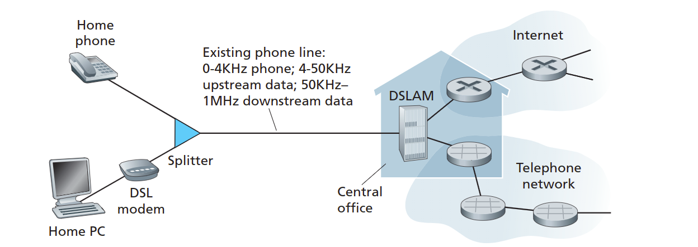
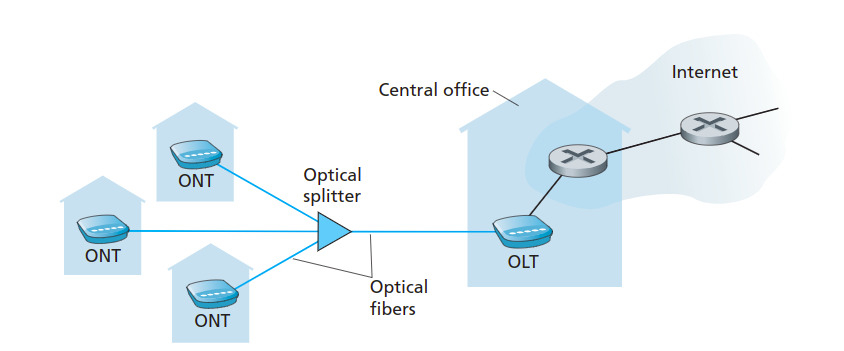
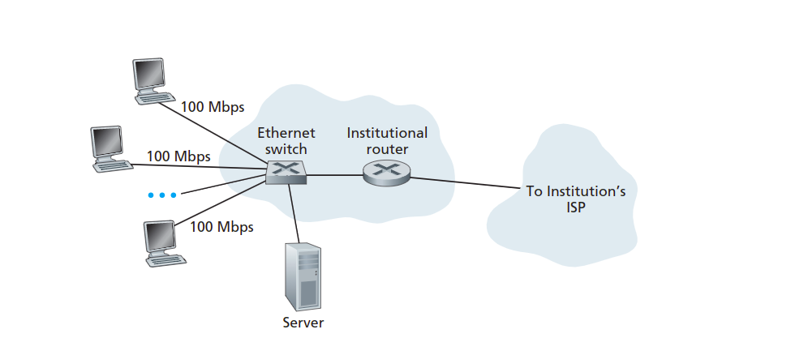

# Access Networks

## Home Access: DSL,Cable,FTTH,Dial-Up,and Satellite

### DSL

Today, the two most prevalent types of broadband residential access are **digital subscriber line (DSL)** and cable. A residence typically obtains DSL Internet access from the same local telephone company(telco) that provides its wried local phone access.Thus, when DSL is used, a customer's telco is also its ISP.

The residential telephone line carries both data and traditional telephone signals simultaneously, which are encode at difference frequencies:

- A high-speed downstream channel , in the 50 kHz to 1MHz band.
- A medium-speed upstream channel, in the 4 kHz to 50 kHz band.
- An ordinary two-way telephone channel, in the 0 to 4 kHz band.

This approach makes the single DSL link appear as  if there were three separate links, so that a telephone call and an Internet connection can share the DSL link at the same time

On the customer's side a splitter separates the data and telephone signals arriving to the home and forwards the data signal to the DSL modem. On the telco side ,in the **CO(Central office)**,the DSLAM separates the data and phone signals and sends the data into the Internet. Hundreds or even thousands of households connect to a single DSLAM.

### Cable Internet access

Cable Internet access makes use of the cable television company's existing cable company that provides its cable television.

As illustrated in Figure,fiber optics connect the cable head end to neighborhood-level junctions, from which traditional coaxial cable is then used to reach individual houses and apartments. Each neighborhood junction typically supports 500 to 5000 homes. Because both fiber and coaxial cable are employed in this system, **it is often referred to as hybrid fiber coax(HFC)** 

**Cable Internet access requires special modems, called cable modems.** As with a DSL modem, the cable modem is typically an external device and connects to the home PC through an Ethernet port.

At the cable head end, **the cable modem termination system(CMTS )serves** a similar function as the DSL network's DSLAM - turning the analog signal sent from the cable modems in many downstream homes back into digital format.

### FTTH(fiber to the home)

Although DSL and cable network currently represent more than 90 percent of residential broadband access in the united States , an up-and-coming technology that promises even hight speeds is **the deployment of fiber to the home(FTTH).**

As the name suggests , the FTTH concept is simple-provide an optical fiber path from the CO directly to the home.

There are several competing technologies for optical distribution from the CO to home. The simplest optical distribution network is called direct fiber,with one fiber leaving the CO for each home. More commonly each fiber leaving the CO(central office) is actually shared by many homes. These are two competing optical-distribution network architectures that perform this splitting : **active optical networks (AONs) and passive optical networks(PONs).**

Here, we briefly discuss PON, which is used in Verizon's FIOS service.

Each home has an optical network terminator(ONT),which is connected by dedicated optical fiber(Optical fibers) to a neighborhood splitter. The splitter combines a number of homes(typically less than 100) onto a single, shared optical fiber,which connects to an **optical line terminator(OLT)** in the telco's CO. The OLT providing conversion between optical line and electrical signals, connects to the Internet via a telco router. In the home, users connect a home router(typically a wireless router) to the ONT and access the Internet via this home router.

### Satellite

In location where DSL, cable and FTTH are not available, a satellite link can be used to connect a residence to the Internet at speed of more than 1 Mbps; StarBand and HughesNet are two such satellite access providers.

### Dial-up access

Dial-up access over traditional phone lines is based on the same model as DSL - a home modem connect over phone line to a modem in the ISP. Compared with DSL and other broadband access networks , dial-up access is excruciatingly slow at 56 kbps.

## Access in the Enterprise(and the home): Ethernet and WiFi

On corporate and university campuses and increasingly in the home setting , **a local area network(LAN)** is used to connect an end system to the edge router. Although there are many types of LAN technologies, Ethernet is by far the most prevalent access technology in corporate, university and home networks. As shown in the Figure. Ethernet users use twisted-pair copper wire to connect to an Ethernet switch.

The Ethernet switch or a network of such interconnected switch is then into the larger Internet. With Ethernet access, users typically have 100 Mbps access to the Ethernet switch, whereas servers may have 1 Gbps or even 10 Gbps access.

Increasingly, however people are accessing the Internet wirelessly from laptops, smartphones, tablets and other devices. In the a wireless LAN setting, wireless users transmit/receive packets to/from an access point that is connected into the enterprise's networks,which in turn is connected to the wired Internet. A wireless LAN user must typically be within a few ten of meters of the access point. Wireless LAN access based on IEEE 802.11 technology, more colloquially known as WiFi.(A wireless LAN user must typically be within a few ten of meters of the access point.)

Many home combine broadband residential access(that is cable modem or DSL) with these inexpensive wireless LAN technology to create powerful home networks. Figure shows a typically home networks. This home network consist of roaming laptop as well as wired PC; a base station(the wireless access point),which communicates with the wireless PC; a cable modem providing broadband access to the Internet; and a router,which interconnects the base station and the stationary PC with the cable modem.

## Wide-Area Wireless Access: 3G and LTE

Increasingly, devices such as iphone, Blackberrys and Android devices are being used to send email, surf the Web, Tweet,and download music while on the run. These devices employ the same wireless infrastructure used for cellular telephony to send/receive packets through a base station that is operated by cellular network provider. Unlike WiFi , a user need only be within a few tens of kilometers(as opposed to a few tens of meters) of the base station.

Telecommunications companies have made enormous investments in so-called third-generation(3G) wireless,which provides packet-switched wide-area wireless Internet access at speeds in excess of 1 Mbps, But even higher-speed wide-area accesss technologies - fourth-generation(4G) of wide-area wireless networks are alread being deployed. LTF(Long-Term Evolution) has its root in 3G technology and can potentially achieve rates in excess of 10 Mbps. LTF downstream rates of many tens of Mbps have been reported in commercial deployments.

# Physical Media

Physical media fall into two categories: **guided media** and **unguided media** with guided media, the waves are guided along a solid medium, such as a fiber-optic cable, a twisted-pair copper wire or a coaxial cable. with unguided media, the waves propagate in the atmosphere and in outer space, such as in a wireless LAN or a digital satellite channel.

## Twisted-Pair Copper Wire

The least expensive and most commonly used guided transmission medium is twisted-pair copper wire. In fact, more than 99 percent of the wired connection from telephone handset to the local telephone switch use twisted-pair copper wire. Twisted pair consist of two insulated copper wires, each about 1 mm thick, arranged in a regular spiral patten. The wires are twisted together to reduce the electrical interference from similar pairs close by. Typically a number of pairs are bundled together in a cable by wrapping the pairs in protective shield. **Unshielded twisted pair(UTP)** is commonly used for computer networks within a building  ,that is for LAN. Data rates for LANs using twisted pair today range from 10 Mbps to 10 Gpbs. The data rates that can be achieve depend on the thickness of the wire and the distance between transmitter and receiver.

## Coaxial cable

Coaxial cable is quite common in cable television system. As we saw earlier, cable television system have recently been couple with cable modems to provide residential users with Internet access at rate of tens of Mbps. In cable television and cable Internet access, the transmitter shifs the digital signal to a specific frequency band, and resulting analog signal is send from the transmitter to one or more receivers. Coaxial cable can be used as a guided shared medium. Specifically , a number of end systems can be connected directly to the cable, with each of the end systems receiving whatever is send by the other end system.

## Fiber Optics

An optical fiber is a thin, flexible medium that conducts pulses of light, with each pulse representing a bit. A single optical fiber can support tremendous bit rates, up to ten or even hundreds of gigabits per second. They are immune to electromagnetic interference , have  very low signal attenuation up to 100 kilometers and are very hard to tap. There characteristics have made fiber optics the preferred long-haul guided transmission media, particularly for overseas links. Many of the long-distance telephone networks in the united states and elsewhere now use fiber optics exclusively. However the high cost of optical devices- such as transmitters receivers and switches - has hindered their deployment for short-haul transport, such as in a LAN or into the home in a residential access network.

## Terrestrial Radio Channels

Radio channels carry signal in the electromagnetic spectrum. They require no physical wire to be installed can penetrate walls, provide connectivity to mobile user, and can potentially carry a signal for long distances. The characteristics of a radio channel depend on significantly on the propagation environment and the distance over which a signal is to be carried.

Terrestrial radio channels can be broadly classified into three groups: those that operate over very short distance(e.g : with one or two meters); those that operate in local areas, typically spanning from ten to a few hundred meters; and those that operate in the wide area spanning tens of kilometers. Personal devices such as wireless headsets, keyboards and medical devices over short distances; the wireless LAN technologies use local-area radio channels; the cellular access technologies use wide-area radio channels.

## Satellite Radio Channels

A communications satellite links two or more Earth-based microwave transmitter/receivers, known as ground stations. The satellite receives transmissions on one frequency band, regenerates the signal using a repeater and transmits the signal on another frequency. two type of satellite are used in communications: **geostationary satellites and low-earth orbiting(LEO) satellite.**

Geostationary satellites permanently remain above the same spot on Earth. This stationary presence achieve by placing the satellite in orbit at 36000 kilometers above Earth's surface. This huge distance from ground station through satellite back to ground station introduces a substantial signal propagation delay of 280 milliseconds. Nevertheless, satellite links, which can operate at speed of hundreds of Mbps , are often used in areas without access to DSL or cable-based Internet.

LEO satellites are placed much closer to Earth and do not remain permanently above one spot on Earth. They rotate around Earth(just as the moon does) and may communicate with each other as well as ground stations. To provide continuous coverage to an area , many satellite need to be place in orbit. there are currently may low- altitude communications system in development. LEO satellite technology may be used for Internet access sometime in the future.